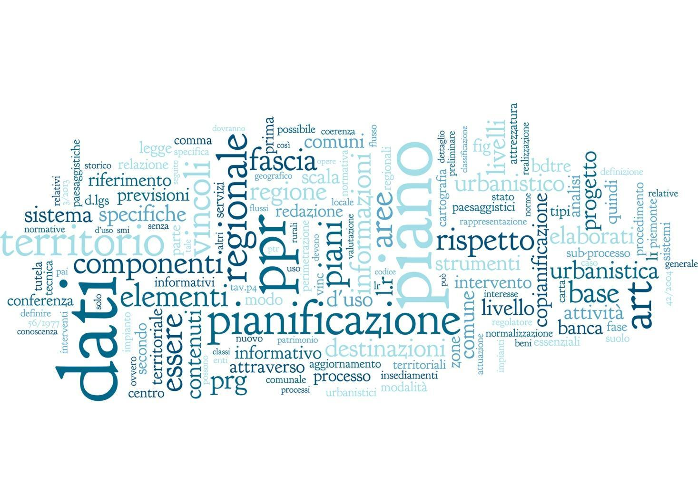

**Progetto USC**

Contenuti
---------

.. toctree::
    :caption: Indice
    :maxdepth: 2

    docs/1____progetto
    docs/1___regole_e_strumenti
    docs/1-1__componenti
    docs/1_1_1_livellibase
    docs/1_1_2_a-vincoli
    docs/1_1_2_b-rir
    docs/1_1_2_c-acustica
    docs/1_1_2_d-commercio
    docs/1_1_2_e-retiEco
    docs/1_1_2_f-PPR
    docs/1_1_2_g-perimetrazioni
    docs/1_1_2_h-usosuolo
    docs/1_1_2_i-capuso
    docs/1_1_2_l-usosuolo
    docs/1_1_3_a-MIP
    docs/1_1_3_b-destuso
    docs/1_1_3_c-matricedestuso
    docs/1_1_3_d-AUP
    docs/1_1_3_e-modatt
    docs/1_1_3_f-tipint
    docs/1_1_3_g-confronto
    docs/1_1_3_h-ZTO
    docs/1_1_3_i-znorm
    docs/elaborati
    docs/licenza
    docs/Acura

.. raw:: html
       :file: disqus.html
